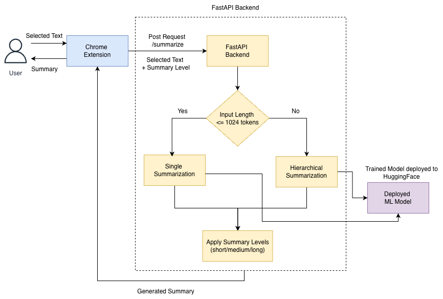

# SummarizeME  
A Chrome Extension for On-Demand Text Summarization Using a FastAPI Backend

## Overview

SummarizeME is a Chrome extension that enables users to generate summaries of any selected text on a webpage through a simple right-click interaction. The selected text is sent to a FastAPI backend, which performs text summarization using a transformer-based model and returns the result to be displayed in a Chrome side panel.

The system supports generic text summarization and provides configurable summary lengths such as short, medium, and long.

## Demo Video


## Repository

GitHub Repository: https://github.com/shahakanksha-tamu/SummarizeME.git

Clone the repository:
```
git clone https://github.com/shahakanksha-tamu/SummarizeME.git
cd SummarizeME
```

## Deployed Model

The backend uses a fine-tuned FLAN-T5 Large transformer model for abstractive text summarization.

 - Base Model: Google FLAN-T5 Large
 - Fine-tuning Approach: Parameter-Efficient Fine-Tuning (LoRA)
 - Training Data: SAMSum datasets
 - Task: Generic abstractive summarization (non-dialogue and dialogue text)

The model is hosted on Hugging Face and loaded by the FastAPI backend during inference.

Hugging Face Model:  https://huggingface.co/akankshashah/flan-t5-base-samsum-merged


## Project Structure

```
SummarizeME/
 ├── manifest.json              # Chrome extension manifest (MV3)
 ├── background.js              # Context menu and side panel logic
 ├── panel/
 │     ├── panel.html           # Side panel UI
 │     ├── panel.js             # Panel logic and API calls
 │     └── panel.css            # Styling
 └── backend/
 │     ├── app/
 |      |
 |      |     ├── config.py          # Hugging Face and model configurations
 |      │     ├── main.py            # FastAPI app entry point
 |      │     ├── routers/           # API routes
 |      │     └── summarizer.py      # Model inference logic
 |      |     ├── model_holder.py    # Model Loading from HuggingFace
 |      ├── requirements.txt
 |__ model/
```

## System Architecture

The system consists of two main components:

### Chrome Extension (Frontend)
- Captures user-selected text from a webpage  
- Adds a right-click Summarize context-menu option  
- Opens a Chrome side panel  
- Sends text and metadata to the backend  
- Displays the generated summary  

### FastAPI Backend (Inference Server)
- Exposes REST APIs for summarization  
- Loads the transformer-based summarization model  
- Generates and returns summaries to the extension  



## Backend Setup and Execution

### Prerequisites
- Python 3.9 or higher
- pip3

### Install Dependencies
```
cd backend
pip install -r requirements.txt
```

### Hugging Face Access Token Setup (For Loading the Model)

The backend loads the summarization model deployed on the Hugging Face at runtime. While the model is made public, using a Hugging Face access token helps avoid rate limits and ensures reliable downloads.

1) Create a Hugging Face Token

 - Go to your Hugging Face account settings → Access Tokens:
https://huggingface.co/settings/tokens

 - Click New token

 - Choose Read permissions (this is sufficient for downloading public models)

 - Create the token and copy it (you will not be able to view it again)

2) Add the Token to Config file 

```
os.getenv("HF_TOKEN", "HF_TOKEN_PLACEHOLDER")
```

### Start the Backend Server
```
uvicorn backend.app.main:app --reload --port 8000
```

The backend will be available at:
http://localhost:8000

API documentation:
http://localhost:8000/docs

## Chrome Extension Setup

1. Open Chrome and navigate to:
   chrome://extensions/

2. Enable **Developer Mode** (top-right corner).

3. Click **Load unpacked** and select the root `SummarizeME/` folder.

4. Verify that the extension **SummarizeME** is enabled.


## Using the Application

1. Ensure the backend server is running.
2. Open any webpage in Chrome.
3. Select any text.
4. Right-click and choose SummarizeME.
5. The Chrome side panel opens automatically.
6. The generated summary is displayed.


